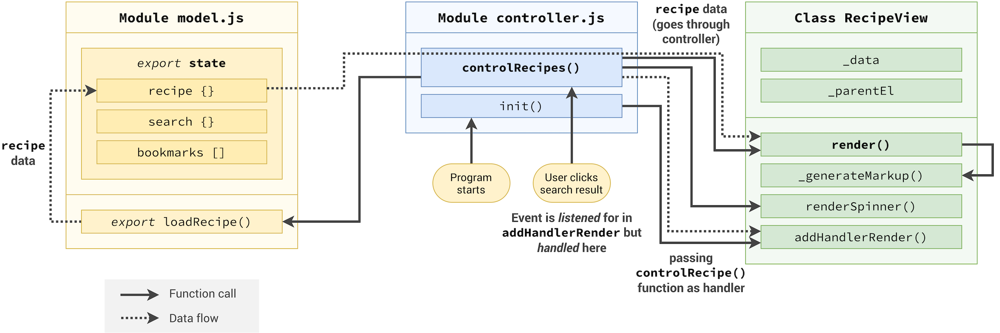
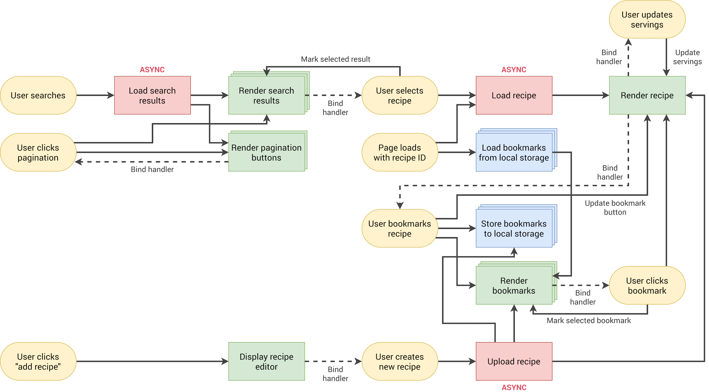

# Forkify - Recipe Search Application

A modern recipe search application built with vanilla JavaScript as part of "The Complete JavaScript Course 2024" by Jonas Schmedtmann on Udemy.

## Demo

Visit the live application: [https://newl6un.github.io/forkify_learningJS/](https://newl6un.github.io/forkify_learningJS/)

## About

Forkify is a recipe search and bookmark application that allows users to search for recipes, view detailed cooking instructions, adjust serving sizes, and bookmark their favorite recipes. This project demonstrates modern JavaScript concepts including ES6+ features, async/await, API integration, and MVC architecture.

## Features

- Search for recipes from a comprehensive recipe database
- View detailed recipe information including ingredients and cooking instructions
- Adjust serving sizes with automatic ingredient calculation
- Bookmark favorite recipes for easy access
- Add your own custom recipes
- Responsive design for all device sizes

## Architecture

The application follows the Model-View-Controller (MVC) architectural pattern for better code organization and maintainability.



## Application Flow

The application implements a sophisticated state management system with clear separation of concerns between data handling, user interface, and business logic.



## Technologies Used

- Vanilla JavaScript (ES6+)
- HTML5
- SCSS/Sass
- Parcel (Build tool)
- Forkify API

## Installation

1. Clone the repository

```bash
git clone https://github.com/Newl6un/forkify_learningJS.git
```

2. Navigate to the project directory

```bash
cd forkify_learningJS
```

3. Install dependencies

```bash
npm install
```

4. Start the development server

```bash
npm start
```

5. Build for production

```bash
npm run build
```

## Course Information

This project was built as part of "The Complete JavaScript Course 2024" by Jonas Schmedtmann on Udemy. The course covers modern JavaScript development practices, advanced concepts, and real-world application building.

Course Link: [The Complete JavaScript Course 2024](https://www.udemy.com/course/the-complete-javascript-course/)

## Acknowledgments

- Jonas Schmedtmann for the excellent course content and project guidance
- Forkify API for providing the recipe data
- The JavaScript community for continuous learning resources
